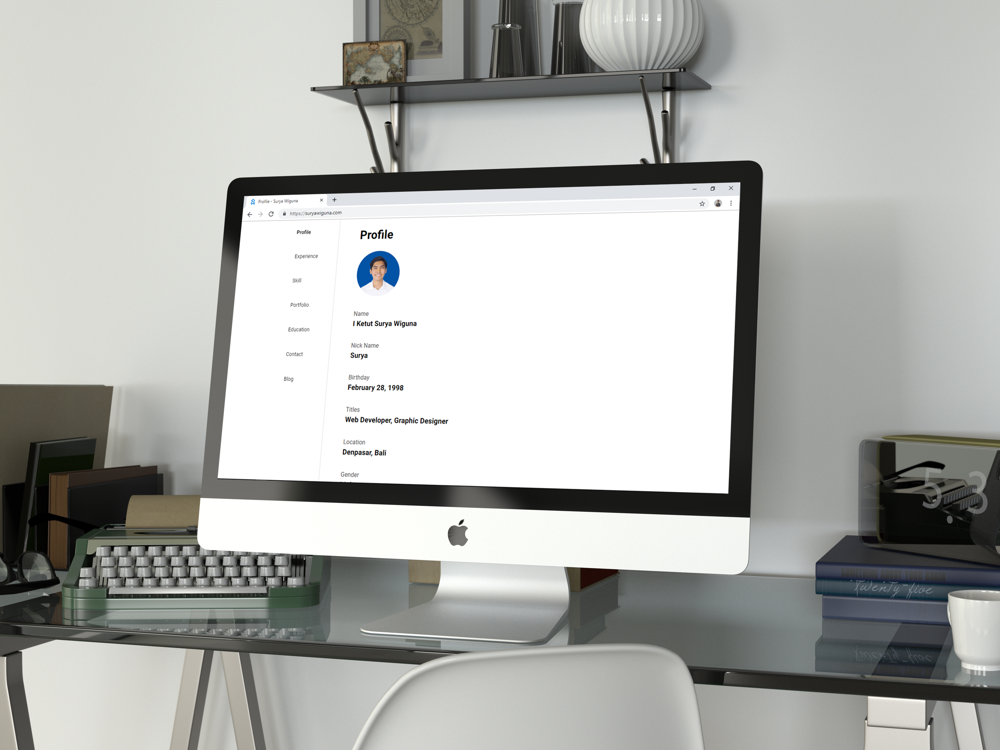

Sudah lama saya ingin memiliki satu website pribadi yang menjadi tempat untuk membangun personal branding dan untuk membagikan tulisan-tulisan lewat blog. Namun, setelah saya mencoba berbagai platform mulai dari blog mainstream seperti Blogspot, Wordpress, hingga yang agak indie seperti GitHub Pages, semua website saya yang sebelumnya itu masih tradisional dengan link biasa yang jika diklik masih menampilkan loading spada browser. Akhirnya saya mengenal Vue.js dengan segala kehebatannya dan site generatornya seperti [Gridsome](https://gridsome.org) (yang saya pakai untuk membuat website ini), dan Vuepress.

## Kenapa Gridsome?

Pertama, saya lihat Gridsome lebih simple dan lebih cocok untuk website yang tidak terlalu kompleks seperti website pribadi jika dibandingkan menggunakan Vuepress dengan fitur yang lebih banyak. Hal yang membuat gridsome menarik adalah karena membawa fitur-fitur seperti membuat halaman baru hanya dengan menambah halaman, perubahan pada kode langsung terlihat tanpa perlu refresh browser (**hot reloading**), data berasal dari file local menggunakan GraphQL data layer, code-spliting jadi manajemen kode lebih mudah, dan static files generation.

## Markdown dan GraphQL
Selain Vue.js, hal lain yang benar-benar baru bagi saya adalah Markdown dan GraphQL. Markdown itu intinya adalah file berekstensi .md yang punya format sendiri yang biasanya dipakai untuk membuat file statis seperti dokumentasi dan bisa juga untuk blog. Contohnya seperti ini:

    ## Ini Heading Level 2

    **Ini paragraph bercetak tebal**

## Ini Heading Level 2

**Ini paragraph bercetak tebal**

Sedangkan GraphQL itu merupakan query untuk mengambil data, yang penggunaannya familiar seperti JSON. Explore lebih jauh di [Websitenya GraphQL](https://graphql.org).

Untuk sekarang saya sudah cukup puas dengan website saya sekarang, semoga dengan ini saya bisa lebih sering menulis untuk berbagi ke kalian tentang apapun yang terlintas.