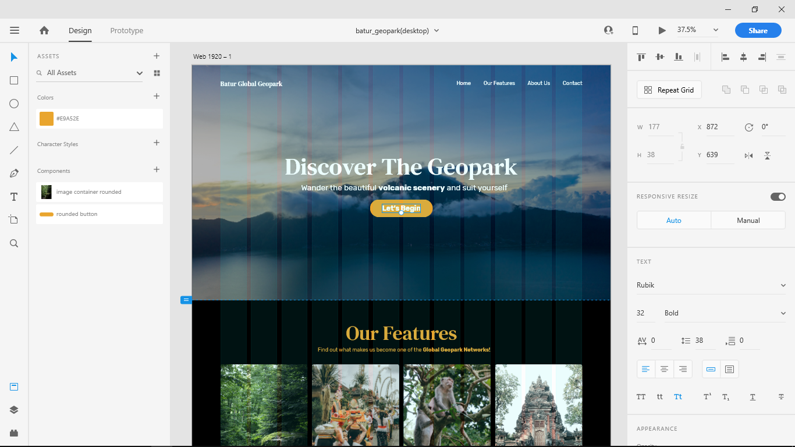

Sejak kuliah, aku sebenarnya sudah tertarik dengan UI design namun belum sampai pada keinginan untuk mempelajarinya lebih jauh. Sampai saatnya setelah lulus aku menemukan satu akun instagram yang dimiliki oleh orang indonesia yang berprofesi sebagai freelancer khususnya di bidang UI/UX design dan juga mobile development, aku jadi penasaran bagaimana cara mendesain user interface yang baik yang diterima oleh industri tanpa mengorbankan user experience hanya untuk memperindah tampilannya.

Setelah membaca banyak informasi mengenai ui design, lalu install lah aku Adobe XD di laptopku, aku baru tau itu gratis dan alternatif Sketch yang bagus untuk platform Windows. Baru tau juga kalo XD itu singkatan dari Experience Design, haha. Setelah aku coba buat desain UI pertamaku yang aku ambil dari project freelanceku tentang profile website dengan banyak perubahan dan diambil alih imajinasiku, kemudian aku sadar harus punya portfolio online tempat memamerkan hasil desainku, kemudian buatlah aku akun behance dan mengupload desain pertamaku di sana, yaitu [Batur Global Geopark - Website Concept](https://www.behance.net/gallery/82942741/Batur-Global-Geopark-Website-Concept) *take a look at it! ;)*

Adobe XD itu ternyata enak banget pakainya, dan emang bener-bener untuk UI/UX design. Edit images, shape, text, color, jadi gampang banget dan presisi sampai ke tingkat pixel. Aku yang dulunya utak-atik desain web lewat css atau pakai bootstrap, sekarang saat menggunakan Adobe Xd aku gak merasakan perbedaan yang jauh selain tidak perlu menulis syntax kalau di Adobe XD.

Untuk sementara ini sepertinya aku akan fokus ke UI design di platform web dulu, selain karena memang aku sudah berkutat 3 tahun lebih dengan web sehingga lebih paham kebiasaan user saat menggunakan web jadi saat mendesain UI nya jadi lebih efektif, juga karena desain pada platform web lebih flexible dengan berbagai size layar gadget yang ada yang menjadi tantangan tersendiri. Tapi, aku juga mulai tertarik dengan aplikasi mobile karena sedang banyak permintaan. Jadi, untuk sekarang kamu bisa cek behance aku [di sini](https://www.behance.net/suryawiguna). Terima kasih sudah membaca ini, beri responmu terhadap tulisanku ini dan jika suka kamu bisa share ke temanmu dan tuliskan pendapatmu di komentar di bawah.