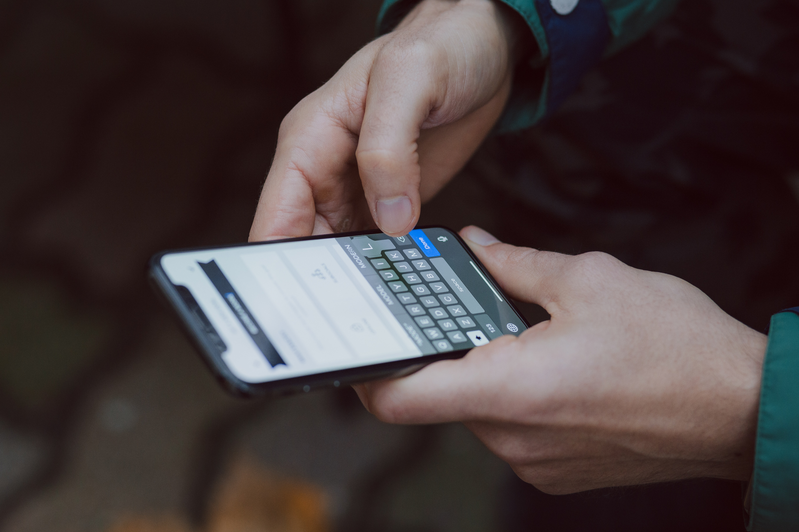

Sejak masa kuliah, aku sebenarnya sudah tertarik dengan UI design namun belum sampai pada keinginan untuk mempelajarinya lebih jauh. Sampai saatnya setelah lulus aku menemukan salah satu akun instagram asal indonesia yang merupakan seorang freelancer di bidang UI/UX design khususnya dan juga mobile development, aku jadi kepo gimana sih caranya mendesain user interface yang baik yang diterima oleh industri tanpa mengorbankan user experience hanya untuk memperindah tampilannya.

Lalu install lah aku Adobe XD, karena aku baru tau itu gratis dan alternatif Sketch yang bagus untuk platform Windows. Baru tau juga kalo XD itu singkatan dari Experience Design, haha. Setelah aku coba buat desain UI pertamaku yang terinspirasi dari project freelanceku tentang profile website, kemudian aku sadar harus punya portfolio online tempat hasil desainku nanti aku pamerkan, kemudian buatlah aku akun behance dan mengupload desain pertamaku, yaitu [Batur Global Geopark - Website Concept](https://www.behance.net/gallery/82942741/Batur-Global-Geopark-Website-Concept) *take a look at it! ;)*

Adobe XD ternyata enak banget pakainya, dan emang bener-bener untuk UI/UX design. Edit gambar, shape, text, color, jadi gampang banget dan presisi atau istilah kerennya pixel perfect. Yang dulunya aku ngutak-atik desain web lewat css atau pakai bootstrap, dan sekarang utak-atiknya lewat Adobe Xd aku gak merasakan perbedaan yang terlalu jauh selain tidak perlu menulis syntax kalau di Adobe XD.

Untuk sementara ini rasanya aku akan fokus ke UI design di platform website dulu, selain karena memang aku sudah berkutat 3 tahun lebih dengan web, juga karena desain pada platform web lebih flexible dengan berbagai size layar gadget yang ada yang menjadi tantangan tersendiri. Tapi, aku juga mulai tertarik dengan aplikasi mobile karena sedang banyak permintaan. Jadi, untuk sekarang kamu bisa cek behance aku [di sini](https://www.behance.net/suryawiguna).